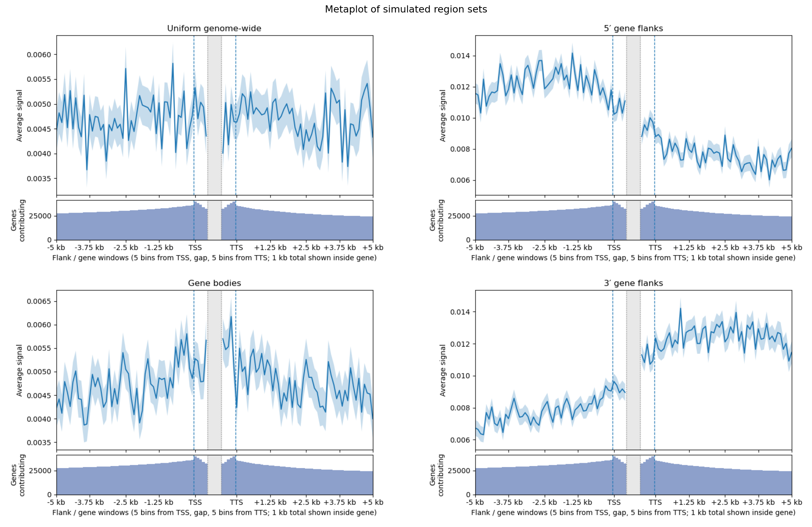

# FineMap: Reproducing the Pipeline

This file holds the operational detail for rebuilding the FineMap maps and analyses: environment, input files, every command, script options, cleaning rules, intermediate-file formats and checks. For an overview of the method and the results, see [README.md](README.md).

## Contents

- [Environment](#environment)
- [Input Data](#input-data)
  - [Reference Files](#reference-files)
  - [Crossover Interval Sources](#crossover-interval-sources)
  - [Genetic Map](#genetic-map)
- [Pipeline](#pipeline)
  - [Step 1 — European HMM Crossover Calling](#step-1--european-hmm-crossover-calling)
  - [Step 2 — Lift-Over To B73 v5](#step-2--lift-over-to-b73-v5)
  - [Step 3 — Building jri_v5.bed](#step-3--building-jri_v5bed)
  - [Step 4 — Deriving finemap_v5.bed](#step-4--deriving-finemap_v5bed)
    - [Alternative Hierarchical Map](#alternative-hierarchical-map)
  - [Step 5 — HapMap Exports](#step-5--hapmap-exports)
  - [Release Check](#release-check)
- [Analysis](#analysis)
  - [Marey Map: Ogut vs finemap_v5](#marey-map-ogut-vs-finemap_v5)
  - [Local Rate: Ogut vs finemap_hierarchical_v5](#local-rate-ogut-vs-finemap_hierarchical_v5)
  - [Recombination Rate Around Genes](#recombination-rate-around-genes)
  - [Recombination Rate vs Gene Density](#recombination-rate-vs-gene-density)
  - [Gene ± 1 kb Coverage: Physical vs Genetic](#gene--1-kb-coverage-physical-vs-genetic)
  - [Nucleotide Diversity Analyses](#nucleotide-diversity-analyses)
  - [Recombination Hotspots and the Resolution Limit](#recombination-hotspots-and-the-resolution-limit)
- [Simulation Regions](#simulation-regions)

## Environment

`environment.yml` defines the conda environment used in this repo, including the Python plotting/data dependencies and CrossMap.

## Input Data

### Reference Files

- `data/v5.fa.gz.fai` — B73 v5 chromosome lengths
- `data/v5.genes.gff3` — B73 v5 protein-coding gene annotations
- `data/NAM_centromere_coords-cenH3.csv` — B73 centromere coordinates (CenH3-based)

Reference data downloaded from [MaizeGDB](https://www.maizegdb.org/):

Margaret R Woodhouse, Ethalinda K Cannon, John L Portwood 2nd, Jack M Gardiner, Rita K Hayford, Olivia Haley, Carson M Andorf. (2025) Tools and Resources at the Maize Genetics and Genomics Database (MaizeGDB). Cold Spring Harb Protoc. 2025(1). 10.1101/pdb.over108430

### Crossover Interval Sources

Four published crossover interval datasets are combined (citations in [README.md](README.md#data)). The European intervals (AGPv2) were called in-house from the Bauer et al. SNP workbook (`data/gb-2013-14-9-r103-S4.xlsx`); the other three come as pre-called interval tables.

Raw Samayoa interval files (columns: `taxon`, `chr`, `start`, `end`):

- `data/xo_Combined_LR13_LR14_parents2_AGPv4_filter0219.txt`
- `data/xo_ZeaGBSv27raw_RareAllelesC2TeoCurated_depth_AGPv4_filtered0210.txt`

### Genetic Map

`data/ogut_fifthcM_map_agpv2.csv` — fifth-cM marker map in AGPv2 coordinates, used to set chromosome-scale genetic lengths for normalization.

`data/ogut_v5.csv` — Ogut markers lifted to B73 v5 coordinates via CrossMap (`data/v2v5.chain`). Columns: `chr`, `pos_v5`, `SNP_newID`, `cM`, `cM_norm`. Generated by `scripts/plot_marey_comparison.py --regenerate-ogut-v5`, then filtered with `scripts/verify_ogut_v5.py --filter`. The filter keeps only markers whose AGPv2 sequence (±50 bp) is found exactly at the lifted v5 position (≤5 mismatches, either strand), or whose one-sided flank (the marker base plus 50 bp to one side) matches there with ≤2 mismatches, which rescues correctly placed markers next to an indel between the assemblies. This needs `data/B73_RefGen_v2.fa.gz` from MaizeGDB (https://download.maizegdb.org/B73_RefGen_v2/), bgzipped and indexed with `samtools faidx`. 6,024 of 6,139 lifted markers pass (94 of them on one flank only). The 35 markers still out of cM order sit in blocks that are inverted between AGPv2 and v5; the Ogut cM order follows AGPv2.

## Pipeline

### Step 1 — European HMM Crossover Calling

European crossovers were called from the Bauer et al. SNP workbook (`data/gb-2013-14-9-r103-S4.xlsx`, sheet `Table_S3`) using an HMM pipeline. This produces the 32,548 European intervals that feed into `data/jri_v5.bed` (lift-over counts are in Step 2).

Script: `scripts/hmm_co_pipeline.py`

```bash
python scripts/hmm_co_pipeline.py \
  --input-xlsx data/gb-2013-14-9-r103-S4.xlsx
```

**Marker cleaning** (per population):

1. Remove rows with missing fields, `chr_phy == 0`, or `raw_data` length ≤ 6.
2. Deduplicate markers at the same `(chromosome, coordinate)`, keeping the row with the most informative genotypes.
3. Remove individuals with missingness > 0.30.
4. Remove markers with missingness > 0.20.
5. Remove markers with informative A fraction outside 0.10–0.90.
6. Remove markers with isolated-flip rate > 0.12. The rate is computed on the retained individuals only, and only between neighbouring markers on the same chromosome (the first and last marker of each chromosome are never flagged).

This run retained 23 cleaned population matrices, 2,209 individuals and 275,076 markers.

**HMM model:** run per population, chromosome, and individual. States: `A`, `B`. Emissions: match 0.98, mismatch 0.02, missing 0.50. Distance-aware transitions: base rate 1e-8 per bp, clamped to [1e-6, 0.05]. Decoded with Viterbi. A crossover is called at each state change, and its interval runs from the last marker before the change whose observed genotype matches the left decoded state to the first marker after it whose genotype matches the right decoded state; missing or discordant genotypes next to the change widen the interval rather than narrow it. If two successive calls in an individual on one chromosome have interval midpoints within 2,000,000 bp, both are discarded as a likely genotyping artefact (they are not merged). Produced 32,548 intervals (median width 293 kb; 5th–95th percentile 27 kb–6.26 Mb). `python scripts/hmm_co_pipeline.py --self-test` checks the interval and flip rules on synthetic data.

Regenerated intermediate outputs: `results/hmm_cleaned_matrices/`, `results/hmm_co_events_long.tsv`, `results/hmm_qc_summary.tsv`, and `results/hmm_sample_roster.tsv` (every analysed individual and chromosome, including those with no crossovers). These are not tracked in the repository; rerun this step before using commands that consume `results/hmm_co_events_long.tsv`.

A Marey map of the HMM intervals can be produced with `scripts/plot_marey_map.py`. The input and output default to `results/hmm_co_events_long.tsv` and `results/marey_map_co_events.png`. The sample roster is required so that individuals without crossovers count in the per-individual denominator:

```bash
python scripts/plot_marey_map.py --sample-roster results/hmm_sample_roster.tsv
```

### Step 2 — Lift-Over To B73 v5

Steps 2 and 3 are run by one script, which needs `results/hmm_co_events_long.tsv` from Step 1:

```bash
python scripts/build_jri_v5.py
```

It writes `data/jri_rm_euro_v5.bed`, `data/xo_Combined_LR13_LR14_parents2_v5.bed`, `data/xo_ZeaGBSv27raw_RareAllelesC2TeoCurated_depth_v5.bed` and `data/jri_v5.bed`. It also writes a per-interval audit, `results/liftover_audit.tsv` (`--audit`), with each endpoint's hits (chromosome, position, strand, chain), the keep/reject reason and the lifted/source length ratio. Use `--outdir DIR` to write elsewhere and `--workdir DIR` to keep the endpoint BED files. `scripts/check_release.py` verifies that the tracked files match the current inputs (see [Release Check](#release-check)).

Endpoints are mapped directly through the aligned blocks of the UCSC chains (`scripts/chain_liftover.py`), keeping each hit's chain and strand. Source coordinates are 1-based SNP positions, so an interval `start..end` is BED `[start-1, end)`, and its endpoint markers are BED `[start-1, start)` and `[end-1, end)`. The v5 interval is `[min lifted position, max lifted position + 1)`. An interval is rejected when:

- either endpoint fails to map (`unmapped_endpoint`) or maps to more than one place (`ambiguous_endpoint`);
- the endpoints land on different chromosomes or on a scaffold;
- the endpoints land on opposite strands, i.e. the interval spans an inversion (`different_strand`);
- the endpoint order is reversed relative to the chain strand (`inconsistent_order`);
- the endpoints lie on different chains and the lifted/source length ratio is outside 0.5–2.0 (`different_chain_length`; set with `--cross-chain-ratio LO HI`, or `--same-chain-only` to reject all cross-chain pairs).

Endpoints on different chains are kept otherwise (`kept_cross_chain`). Chain breaks are frequent in the MaizeGDB v4→v5 chain, and requiring a single chain would drop about 11,000 intervals, concentrated around chain-dense regions. It would change 17.5% of 100 kb bins in the hierarchical map by more than 10% (p95 difference 50%, log-rate r = 0.980). The kept cross-chain intervals preserve length almost 1:1 (median ratio 0.99; 90% within 0.82–1.23, against 0.92–1.10 for same-chain intervals), as expected for breaks within collinear sequence rather than rearrangements. The exact bounds matter little: widening them to 0.1–10 adds 282 intervals and changes 0.8% of bins by more than 10% (p95 0.3%, r = 0.9997). Two regression tests pin the inclusive 0.5 and 2.0 bounds.

**Source QC:** one Samayoa LR13/LR14 row (`14FL991382:250410665`, chr5) has reversed coordinates (start 246,405,086 > end 688,921). It is recorded in the audit as `invalid_source_interval` and skipped.

Chromosome names follow each chain: AGPv2 inputs are written as `Chr1`..`Chr10` for `v2v5.chain`, and AGPv4 inputs as `1`..`10` for `v4v5.chain`. All outputs are normalised to `Chr1`..`Chr10`.

**Chain files:**

- `data/v2v5.chain` — AGPv2 → B73 v5, generated by `scripts/swap_chain.py` from `data/v5v2.chain`
- `data/v5v2.chain` — B73 v5 → AGPv2, derived from an AnchorWave whole-genome alignment (this file was previously misnamed `v2v5.chain`)
- `data/v4v5.chain` — AGPv4 → B73 v5, downloaded from MaizeGDB (`https://download.maizegdb.org/Zm-B73-REFERENCE-NAM-5.0/chain_files/`)

**Intermediate outputs:**

- `data/jri_rm_euro_v5.bed` — Rodgers-Melnick and European intervals (columns: `chr`, `start`, `end`, `sample`, `id`), sorted `sort -k1,1 -k2,2n`. Rodgers-Melnick input is the `hom` rows of the `cn` then `us` tables (`Start`, `End`, `FullSampleName`). European input is `left_coordinate`, `right_coordinate` and `sample_id` from `results/hmm_co_events_long.tsv`.
- `data/xo_Combined_LR13_LR14_parents2_v5.bed`, `data/xo_ZeaGBSv27raw_RareAllelesC2TeoCurated_depth_v5.bed` — Samayoa intervals (columns: `chr`, `start`, `end`, `taxon`), sorted by chromosome number and start.

### Step 3 — Building `jri_v5.bed`

`scripts/build_jri_v5.py` (Step 2) also concatenates the four lifted sources into `data/jri_v5.bed` (columns: `chr`, `start`, `end`, `sample`, `id`), sorted as `sort -k1,1V -k2,2n`. IDs have a source prefix and a six-digit row number:

- `RMv2_NNNNNN`, `EUROv2_NNNNNN` — the row number in the source table, assigned before lift-over. Intervals that fail to lift leave gaps in the numbering.
- `LRv4_NNNNNN`, `TEOv4_NNNNNN` — the row number in the lifted, sorted Samayoa v5 file. These are contiguous.

The script exits with an error unless every output uses only `Chr1`..`Chr10` (all ten present) and has the expected column count. It also checks that every interval has `start < end` within the v5 chromosome length (`data/Zm-B73-REFERENCE-NAM-5.0.fa.gz.fai`), that IDs are unique and well formed, and that each source's ID count in `jri_v5.bed` equals its number of lifted intervals. It prints raw, lifted and retained counts per source.

`data/jri_v5.bed` contains 402,018 crossover intervals across four sources:

| Source | Raw intervals | Lifted | Retention |
|--------|--------------|--------|-----------|
| Rodgers-Melnick NAM | 135,995 | 117,580 | 86.5% |
| European HMM | 32,548 | 27,267 | 83.8% |
| Samayoa LR13/LR14 landrace | 137,100 | 133,183 | 97.1% |
| Samayoa teosinte | 127,546 | 123,988 | 97.2% |

### Step 4 — Deriving `finemap_v5.bed`

`data/finemap_v5.bed` is the default non-overlapping BED6 track: the crossover density in `data/jri_v5.bed` as a piecewise-constant, Ogut-calibrated recombination rate.

**Method:**

1. Assign each interval in `data/jri_v5.bed` a per-bp weight of `1 / (end − start)`.
2. Use a sweep-line algorithm to sum weights across all overlapping intervals at each position; merge consecutive positions with equal summed weight into non-overlapping segments.
3. For each chromosome, normalize weights so the interval-weighted sum equals the Ogut chromosome genetic length in cM.
4. Walk segments in coordinate order, accumulating `cM_start` and `cM_end`; report `cM_per_Mb = (cM_end − cM_start) / (end − start) × 10⁶`.

**Output columns:** `chrom`, `start`, `end`, `cM_start`, `cM_end`, `cM_per_Mb`

**Result:** 261,395 segments; genome-wide average 0.696 cM/Mb across covered sequence.

**Ogut chromosome lengths used for scaling:**

| Chr | cM | Chr | cM |
|-----|----|-----|----|
| Chr1 | 210.4 | Chr6 | 111.4 |
| Chr2 | 161.2 | Chr7 | 138.4 |
| Chr3 | 163.4 | Chr8 | 137.4 |
| Chr4 | 151.8 | Chr9 | 131.2 |
| Chr5 | 157.0 | Chr10 | 113.0 |

Script: `scripts/build_finemap.py` (also regenerates HapMap files)

```bash
python scripts/build_finemap.py
```

#### Alternative Hierarchical Map

`data/finemap_hierarchical_v5.bed` treats each crossover location as interval-censored under a shared chromosome-wide rate function (model described in [README.md](README.md#method)).

For a crossover observed only within the half-open interval `[L_i, R_i)`, its contribution to the conditional likelihood is

$$
P(\text{interval } i \mid r) = \frac{\displaystyle\int_{L_i}^{R_i} r(x)\,dx}{\displaystyle\int_{\text{chromosome}} r(x)\,dx}
$$

The model represents `log(r)` as piecewise constant in 100 kb bins and applies a Gaussian random-walk penalty to differences between neighboring log-rates. It is fitted independently for each chromosome by maximum a posteriori optimization, and each relative rate profile is then scaled to the same Ogut chromosome length used by the default map. The interval-location likelihood identifies the relative spatial profile but not absolute genetic length: multiplying every rate on a chromosome by the same constant leaves the likelihood unchanged. Ogut calibration is used because the effective number and structure of informative meioses are not consistently available across the input mapping populations.

**Output:** `data/finemap_hierarchical_v5.bed` — 21,325 non-overlapping 100 kb segments (with a shorter terminal segment on each chromosome).

**Output columns:** `chrom`, `start`, `end`, `cM_start`, `cM_end`, `cM_per_Mb`

Script: `scripts/build_hierarchical_finemap.py`

```bash
python scripts/build_hierarchical_finemap.py
```

Key options are `--bin-size`, `--smoothness`, `--iterations`, `--learning-rate`, `--tolerance`, `--rate-tolerance`, `--stability-window`, and `--output`. The defaults reproduce `data/finemap_hierarchical_v5.bed`.

**Optimization and convergence.** Each chromosome is fitted by line-searched Newton-CG using exact Hessian-vector products, typically in 14–19 iterations and about 1 s per chromosome. A fit is accepted only when both conditions hold: (i) the largest absolute gradient of the log posterior with respect to any bin's log-rate is at most `--tolerance` (default `1e-6`, in expected crossovers per bin); and (ii) no normalized bin rate has changed by more than `--rate-tolerance` (default `1e-6`, relative) over the last `--stability-window` iterations (default 3). The fit never stops on relative change in the objective, because the log-likelihood carries a large additive constant that says nothing about whether local rates have stabilized. The script prints a per-chromosome summary (iterations, final max |gradient|, max relative rate change, converged). If a chromosome reaches `--iterations` (default 200) first, the script stops with an error and writes no map. An earlier version stopped when the relative change in the objective fell below `1e-7`. On Chr1 that rule stopped after 333 iterations, 2.7 log-likelihood units short of the optimum. At that point 5% of bins were more than 10% away from their converged rates, and the largest gap was about 30%. Sensitivity check on the current inputs: tightening both tolerances 10× or 100× changes per-bin rates by at most 2×10⁻¹¹ on every chromosome. Loosening them to `1e-3` changes rates by at most 2×10⁻⁵. This check shows the optimizer has converged for the chosen `--bin-size` and `--smoothness`. It does not measure the statistical uncertainty of the map, and it does not show how sensitive the map is to those settings.

### Step 5 — HapMap Exports

`data/hapmap/chr{1..10}.hapmap.tsv` — per-chromosome HapMap-format files derived from `data/finemap_v5.bed` for use with `msprime.RateMap.read_hapmap()`.

Format: `Chromosome`, `Position(bp)`, `Rate(cM/Mb)`, `Map(cM)`. One file per chromosome; terminal row rate set to 0 per `msprime` convention. Generated by `scripts/build_finemap.py`.

### Release Check

`scripts/check_release.py` checks that the tracked products agree with each other and were built in dependency order (HMM events → `jri_v5.bed` → both maps → HapMap exports and hotspots). It checks the HMM event/roster counts, reconciles `results/liftover_audit.tsv` with the per-source ID counts in `jri_v5.bed` and the HMM table, checks coordinates and IDs, verifies that each map's cumulative cM never decreases and ends at the Ogut total, checks that the HapMap files match `finemap_v5.bed`, and checks hotspot bounds. It prints PASS/FAIL per check and exits nonzero on any failure.

```bash
python scripts/check_release.py                   # verify (a few seconds)
python scripts/check_release.py --write-manifest  # after a clean rebuild: record sha256 hashes
```

`--write-manifest` writes `data/provenance_manifest.json` (hashes, sizes, row counts and the dependency graph for inputs, scripts and products), and refuses if any consistency check fails. Later runs compare the current files against it and list stale products, meaning products whose upstream files changed after the manifest was written.

## Analysis

### Marey Map: Ogut vs finemap_v5

Compares the Ogut genetic map (AGPv2 markers lifted to v5 via CrossMap) against `finemap_v5.bed` across all ten chromosomes in a 2×5 grid, with B73 centromere positions shaded.

Script: `scripts/plot_marey_comparison.py`  
Outputs: `results/marey_ogut_vs_finemap.png`, `data/ogut_v5.csv`

```bash
python scripts/plot_marey_comparison.py
```

By default, the script reads the tracked `data/ogut_v5.csv` and writes only the plot. To regenerate the tracked lifted Ogut table, run:

```bash
python scripts/plot_marey_comparison.py --regenerate-ogut-v5
```

### Local Rate: Ogut vs finemap_hierarchical_v5

Plots cM/Mb from `data/ogut_v5.csv` and `data/finemap_hierarchical_v5.bed` over a 10 Mb window, with a rug of gene midpoints from `data/v5.genes.gff3`. Ogut cM is linearly interpolated at the hierarchical map's 100 kb bin edges and differenced to give cM/Mb. With no arguments the script draws a random window (weighted by chromosome length, starting on a 100 kb boundary) and prints the seed in the plot title. `--seed N` repeats a draw and `--region CHROM:START` plots a given window.

Script: `scripts/plot_random_region.py`  
Outputs: `results/region_<chrom>_<start>-<end>Mb_ogut_vs_hier.png`

```bash
python scripts/plot_random_region.py --seed 717987               # Chr3:2.4-12.4 Mb
python scripts/plot_random_region.py --seed 929979               # Chr1:158.6-168.6 Mb
```

### Recombination Rate Around Genes

`scripts/metaplot.py` computes mean signal in bins across gene bodies. To plot recombination rate with 5 kb flanks and 500 bp windows at each gene end:

```bash
python scripts/metaplot.py \
  --gff data/v5.genes.gff3 \
  --input data/finemap_v5.bed \
  --value-column 6 \
  --bin-size 100 \
  --flanking-bp 5000 \
  --body-bins 5 \
  --uniform \
  --title "Recombination rate (cM/Mb) around genes" \
  --output results/metaplot_recombination.png \
  --no-show
```

Uses 39,418 protein-coding genes on chr1–chr10 (scaffold genes have no map and are skipped). With `--bin-size 100` and `--body-bins 5`, each gene-end window is exactly 500 bp; flanks extend 5 kb from TSS and TTS. With `--uniform` (default `--uniform-mode mean`), each gene's value in a bin is the overlap-weighted mean rate of the FineMap segments covering it, `sum(cM/Mb × overlap bp) / covered bp`. The denominator is the bp the map actually covers, so a constant rate gives the same value however it is split into segments, and uncovered bp (chromosome ends beyond the first/last segment) are ignored rather than read as zero. A bin with no coverage is dropped for that gene. The curve is the unweighted mean of these per-gene values across genes (±1 SE), with minus-strand genes reversed, so the y-axis is in true cM/Mb. Rate rises from about 1.2 cM/Mb at ±5 kb to about 1.7 cM/Mb at the TSS and TTS and peaks near 2.0 cM/Mb inside the gene. That is well above the genome-wide bp-weighted mean of 0.70 cM/Mb, because genes sit mostly in the high-recombination chromosome arms. The mean at the TSS (1.71) matches the rate read directly at each TSS position (1.70, n = 39,337). Plots made before this fix divided each segment's rate by its length (`--uniform-mode total` semantics), which shrank the values 2.5–30× (0.04–0.82). Flanks, where segments are long, shrank most, so the old curve exaggerated the gene-versus-flank contrast. Keep `--uniform-mode total` for columns that hold interval totals, such as counts or cM lengths.

The gene-body panel is built from whole `--bin-size` windows taken inward from each gene end rather than from a length-normalized rescaling of the full body. For genes shorter than `2 * --body-bins * --bin-size`, the script keeps as many complete bins as fit from the TSS side and from the TTS side and leaves the central gap empty; if the available number of whole bins is odd, the middle bin is dropped.

Key `metaplot.py` arguments:

| Argument | Description |
|----------|-------------|
| `--gff` | Gene annotation GFF/GFF3 |
| `--input` | Signal BED |
| `--value-column` | 1-based value column, default 4; use 6 for `data/finemap_v5.bed` |
| `--bin-size` | Bin width in bp; must divide `--flanking-bp` |
| `--flanking-bp` | Flank length on each side of TSS/TTS |
| `--body-bins` | Bins shown from each gene end inside the body |
| `--uniform` | Use each interval's full span instead of its midpoint (use for rate data) |
| `--uniform-mode` | With `--uniform`: `mean` (default) = overlap-weighted mean over covered bp, for rates such as cM/Mb; `total` = apportion interval totals by overlap / length and sum |
| `--self-test` | Run the synthetic segmentation-invariance checks and exit |
| `--output` | Output PDF (default: `metaplot.pdf`) |
| `--no-show` | Suppress interactive display |

### Recombination Rate vs Gene Density

Plots gene density (genes/Mb) against weighted-average cM/Mb across 100 kb windows genome-wide, with binned medians overlaid.

Script: `scripts/plot_rate_vs_gene_density.py`  
Output: `results/rate_vs_gene_density.png`

```bash
python scripts/plot_rate_vs_gene_density.py
```

### Gene ± 1 kb Coverage: Physical vs Genetic

For each chromosome, computes the fraction of physical bp and fraction of total cM that fall within 1 kb of any gene body (gene ± 1 kb intervals merged).

Script: `scripts/plot_gene_cM_coverage.py` (accepts one or more `--flank` values; default 1000 bp)  
Output: `results/gene_cM_coverage.png`

```bash
python scripts/plot_gene_cM_coverage.py --flank 100 1000
```

| Chr | % bp (±100 bp) | % bp (±1 kb) | % cM (±100 bp) | % cM (±1 kb) |
|-----|---------------|--------------|----------------|--------------|
| 1   | 9.0 | 11.8 | 15.1 | 20.0 |
| 2   | 8.8 | 11.7 | 18.4 | 24.6 |
| 3   | 8.3 | 10.8 | 16.2 | 21.9 |
| 4   | 7.3 |  9.7 | 16.1 | 21.7 |
| 5   | 9.1 | 11.9 | 20.7 | 27.8 |
| 6   | 8.3 | 11.0 | 16.9 | 22.9 |
| 7   | 7.5 | 10.0 | 17.1 | 22.9 |
| 8   | 9.2 | 12.0 | 18.4 | 24.7 |
| 9   | 8.1 | 10.9 | 17.1 | 23.2 |
| 10  | 8.8 | 11.4 | 19.2 | 25.8 |

Shrinking the flank from ±1 kb to ±100 bp reduces %bp by ~2–3 points and %cM by ~5–7 points, but the cM/bp enrichment ratio (~1.7–2.3×) is stable across both windows, suggesting elevated recombination near genes is distributed broadly within the 1 kb flanks rather than concentrated at gene edges.

### Nucleotide Diversity Analyses

The genotype data used for the diversity analyses are unpublished and are not distributed with this repository. The scripts run against any gzipped, one-chromosome-per-file all-sites VCF with haploid calls (FORMAT containing a `GT` key, each `GT` a single allele index or `.`); diploid or polyploid genotypes are rejected. The reference genome and CDS annotation used to annotate 0D/4D sites are downloaded from MaizeGDB and are git-ignored.

| Analysis | Scripts | Outputs | Walkthrough |
|----------|---------|---------|-------------|
| π vs recombination | `scripts/haploid_pi.py`, `scripts/pi_vs_recombination.py` | `results/pi_vs_recombination.png` | [PI_VS_RECOMBINATION.md](PI_VS_RECOMBINATION.md) |
| 0D/4D π vs recombination | `scripts/degenerate_sites.py`, `scripts/haploid_pi.py --restrict`, `scripts/pi_coding_vs_recombination.py` | `results/pi_coding_vs_recombination.png`, `results/pi_coding_vs_recombination_ratio.png`, `results/pi_classes_vs_recombination.png` | [PI_CODING_VS_RECOMBINATION.md](PI_CODING_VS_RECOMBINATION.md) |

### Recombination Hotspots and the Resolution Limit

Scripts: `scripts/finemap_resolution.py`, `scripts/define_hotspots.py`, `scripts/define_hotspots_sliding.py`, `scripts/pi_vs_hotspot_distance.py`  
Output: `results/finemap_resolution.png`

Full writeup, including commands: [PI_VS_HOTSPOT_DISTANCE.md](PI_VS_HOTSPOT_DISTANCE.md)

## Simulation Regions

Simulated BED region sets with interval lengths drawn from the empirical distribution of `data/jri_v5.bed`, placed on B73 v5 chromosomes chr1–chr10. Used for comparison with observed crossover distributions.

| File | Placement |
|------|-----------|
| `data/example1.bed` | Uniform genome-wide |
| `data/example2.bed` | Enriched in strand-aware 5′ gene flanks |
| `data/example3.bed` | Enriched in gene bodies (excluding first and last 5 kb) |
| `data/example4.bed` | Enriched in strand-aware 3′ gene flanks |

Script: `scripts/simulate_example_regions.py`

```bash
python scripts/simulate_example_regions.py
```

This regenerates `data/example1.bed` through `data/example4.bed` and writes `data/simulation_readme.md`.

Metaplots across all four sets (5 kb flanks, 500 bp gene-end windows):

```bash
python scripts/plot_example_metaplots.py
```


