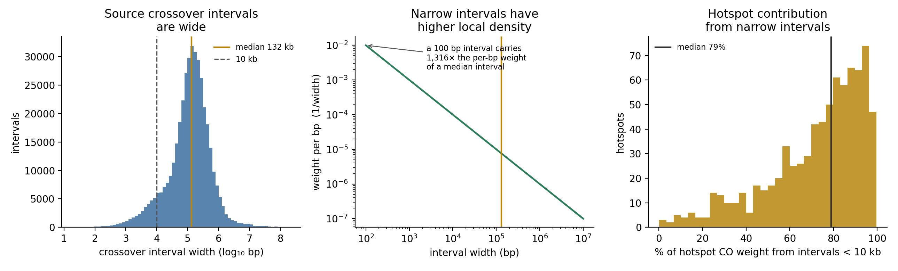
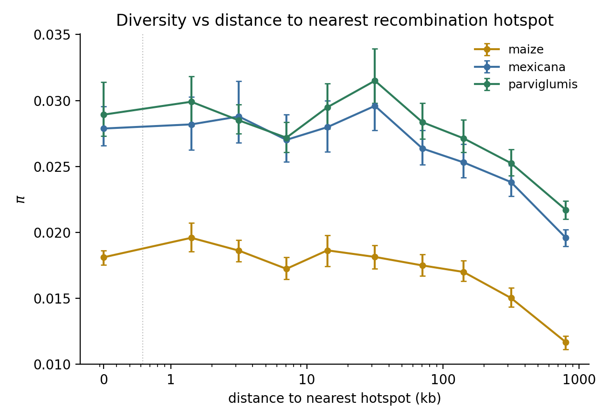

# Recombination Hotspots and the Resolution Limit of FineMap

This began as an attempt to test whether nucleotide diversity (π) is elevated near
recombination hotspots. It ended as a negative methodological result, which is the more
useful finding: **kb-scale structure in `finemap_v5.bed` is dominated by a few narrow
crossover intervals, so hotspots cannot be reliably defined from it at the kb scale.**
Apparent fine-scale hotspots largely reflect how crossover weight is distributed during map
construction, not a feature of recombination.

Anyone planning to use the interval-density map at fine scale should read this first.

## Table of Contents

- [The Resolution Limit](#the-resolution-limit)
  - [How the Map Distributes Crossover Weight](#how-the-map-distributes-crossover-weight)
  - [What This Does to Apparent Hotspots](#what-this-does-to-apparent-hotspots)
- [Why the Obvious Control Cannot Work](#why-the-obvious-control-cannot-work)
- [What Was Actually Run](#what-was-actually-run)
  - [Hotspot Definitions Tried](#hotspot-definitions-tried)
  - [Input Data](#input-data)
  - [Commands](#commands)
- [Results, and Why They Are Not Interpretable](#results-and-why-they-are-not-interpretable)
- [What Would Be Needed Instead](#what-would-be-needed-instead)
- [Reproducing the Diagnostic](#reproducing-the-diagnostic)

## The Resolution Limit

### How the Map Distributes Crossover Weight

`scripts/build_finemap.py` spreads each crossover **uniformly** across its interval,
adding `1 / (end - start)` to every base pair, so each interval integrates to one event:

```python
jri["weight"] = 1.0 / (jri["end"] - jri["start"])
```

This is a sensible choice — a crossover known only to lie somewhere within an interval
should contribute evenly across it. But it has a consequence that matters enormously at
fine scale. Because one event is spread over the interval, the weight *density* per base
pair goes as **1 / width**.

The source crossover intervals in `data/jri_v5.bed` (n = 402,018) are wide:

| statistic | width |
|-----------|-------|
| p5 | 5,242 bp |
| p25 | 52,907 bp |
| median | **131,647 bp** |
| p75 | 287,175 bp |
| p95 | 1,001,291 bp |
| p99 | 5,156,210 bp |
| mean | 480,921 bp |

59.0% are wider than 100 kb; only 8.3% are narrower than 10 kb.

Combining the two facts: a 100 bp interval deposits **~1,316×** the per-bp weight of a
median interval, and a 10 kb interval deposits ~13.2×. The typical crossover contributes a
broad, almost flat smear, while the rare narrow interval contributes a spike.



So sharp features in the map at kb scale trace back largely to a minority of atypically
narrow crossover intervals. Interval width is set by marker density in the source crosses —
where informative markers happen to be dense, a crossover is localized tightly. That is a
property of the genotyping, not of recombination.

### What This Does to Apparent Hotspots

Two hotspot definitions were tried, and the artifact defeats both.

**Point-interval definition** — intervals above a multiple of the genome mean, merged,
with a minimum width. At 50× the qualifying intervals have a median width of 3 bp and 87%
are ≤ 100 bp. Obviously artifactual.

**1 kb sliding-window definition** — the mean rate over a fixed window, expected to fix the
problem by diluting narrow spikes. It does remove the crudest signature: only 7.6% of each
hotspot's cM comes from intervals under 100 bp, and the rate-vs-narrowness rank correlation
flips to −0.787.

That apparent fix is misleading. Testing at 100 bp asks the wrong question, because the
relevant comparison is against the 132 kb typical interval, not against the very narrowest.
Scoring both definitions on the share of crossover weight contributed by intervals under
10 kb — which are 8.3% of the data — shows the artifact dominating both:

| hotspot set | n | median share from < 10 kb intervals | mean | hotspots > 50% |
|-------------|---|--------------------------------------|------|----------------|
| 30× point-interval, ≥ 50 bp | 925 | **92.0%** | 86.7% | 96% |
| 1 kb sliding, 20× | 781 | **78.9%** | 72.1% | 84% |
| *genome-wide baseline* | — | *8.3%* | — | — |

Sliding-window averaging is modestly better, and nowhere near sufficient. Both sets are
built overwhelmingly from the narrow tail of the crossover data. Averaging moved the
artifact up a scale rather than removing it.

## Why the Obvious Control Cannot Work

Hotspots are not randomly located: they fall in distal, high-recombination sequence that
has elevated π for independent reasons (ρ between log distance-to-hotspot and local rate is
−0.74). The natural response is to control for local background rate.

**That control is invalid here, and not for a subtle reason.** The background rate and the
hotspot are computed from *the same crossovers*. Given a median source interval of 132 kb,
a crossover that produces a spike at some position also deposits weight across the
surrounding ~132 kb, which is exactly the neighbourhood the background rate is measured
over. The covariate and the exposure are one measurement at two smoothings.

Two results confirm this empirically:

- Masking the hotspot regions out of the background rate changes essentially nothing:
  ρ(log distance, background) goes from −0.738 to −0.737, and the masked and unmasked
  background rates correlate at **1.000**.
- Within a 100 kb window containing a hotspot, the hotspot itself supplies a median 15.6% of
  the window's genetic length — yet such windows have 18.3× the median local rate
  (4.35 vs 0.24 cM/Mb). The elevation is not the hotspot's own cM; it is the same
  crossovers smeared across the window.

Conditioning on local rate therefore drives any hotspot effect to zero by construction. The
partial correlations reported below are near zero, and that value carries no information.

## What Was Actually Run

The pipeline is documented for reproducibility and because the diagnostics are reusable,
not because the biological result stands.

### Hotspot Definitions Tried

**Point-interval** (`scripts/define_hotspots.py`): runs of contiguous `finemap_v5.bed`
intervals above `--fold` × the length-weighted genome mean, merged, with merged regions
narrower than `--min-width` dropped. At 30× with a 50 bp floor: 9,240 intervals → 1,269
merged runs → **925 hotspots**, median width 307 bp, 1.27 Mb total carrying 39.5 cM.

**1 kb sliding** (`scripts/define_hotspots_sliding.py`): the mean rate over a sliding
window, computed exactly by linear interpolation of cumulative cM at interval breakpoints
rather than by binning, thresholded and merged. At 1 kb / 100 bp step / 20×: 36,496 of
21.19 M windows pass → **781 hotspots**, median width 2.5 kb, 4.37 Mb total carrying
84.84 cM (5.75% of the map in 0.21% of the sequence, 28× enrichment).

Only 657 of the 925 point-hotspots (71%) are recovered by the sliding definition.

The length-weighted genome mean — total cM / total Mb = 1475.2 / 2118.7 = **0.696 cM/Mb** —
is the correct baseline. The unweighted mean of interval rates is 4.60 cM/Mb, inflated
6.6× because the map is dominated by very short intervals.

### Input Data

- `data/finemap_v5.bed` — interval-density map, hotspot source
- `data/finemap_hierarchical_v5.bed` — smoothed 100 kb map, local background rate
- `data/jri_v5.bed` — the source crossover intervals, for the resolution diagnostic
- `data/v5.fa.gz.fai` — chromosome lengths for the fine tiling
- Per-chromosome all-sites VCFs, 29 haploid samples (8 maize, 12 *mexicana*, 9
  *parviglumis*). **Unpublished and not distributed with this repository**; `data/pixy/`
  is git-ignored. See [PI_VS_RECOMBINATION.md](PI_VS_RECOMBINATION.md) for the estimator
  and why pixy is not used.

π was computed in 2 kb windows (1,065,928 windows tiling chr1–chr10) because 100 kb cannot
resolve distance-to-hotspot structure. With `--min-sites 200` (≥10% callable), 309,513
windows are retained. Only 30.7% of windows have any callable site, so the filter removes
empty windows rather than reshaping the sample; results are unchanged at 100 and 500.

### Commands

```bash
# resolution diagnostic -- the actual result of this document
python scripts/finemap_resolution.py \
  --jri data/jri_v5.bed \
  --hotspots data/hotspots_1kb_20x_v5.bed \
  --out results/finemap_resolution.png

# sliding-window hotspots
python scripts/define_hotspots_sliding.py \
  --bed data/finemap_v5.bed --window 1000 --step 100 --fold 20 \
  --out data/hotspots_1kb_20x_v5.bed

# 2 kb pi, then the distance analysis
python scripts/haploid_pi.py \
  --vcf <all-sites VCFs> --populations data/pixy/populations.txt \
  --windows data/pixy/windows_2kb.bed --window-size 2000 \
  --out data/pixy/pi_2kb_windows.tsv

python scripts/pi_vs_hotspot_distance.py \
  --pi data/pixy/pi_2kb_windows.tsv \
  --hotspots data/hotspots_1kb_20x_v5.bed \
  --hierarchical data/finemap_hierarchical_v5.bed \
  --out-prefix results/pi_vs_hotspot_distance_1kb20x
```

| Argument | Description |
|----------|-------------|
| `--window` / `--step` | Sliding window width and stride in bp |
| `--fold` | Threshold as a multiple of the length-weighted genome mean |
| `--min-sites` | Drop fine windows below this many callable sites |
| `--block-mb` | Block bootstrap block size in Mb (fixed, non-overlapping physical blocks) |

## Results, and Why They Are Not Interpretable

Raw π does decline with distance to the nearest hotspot. Using the sliding definition,
maize π falls from 0.0181 on hotspots and 0.0196 at 1–2 kb to 0.0117 beyond 500 kb.



| Population | raw ρ (π vs log distance) | partial ρ given local rate |
|------------|---------------------------|----------------------------|
| maize | −0.265 | +0.005 |
| *mexicana* | −0.243 | +0.002 |
| *parviglumis* | −0.219 | +0.006 |

Neither column answers the question:

- **The raw correlation is real but is not about hotspots.** It is the ~100 kb-to-Mb scale
  recombination gradient, which is already reported in
  [PI_VS_RECOMBINATION.md](PI_VS_RECOMBINATION.md) and measured more directly there. 83% of
  retained windows sit in the > 500 kb bin at a median distance of 10.5 Mb, so much of the
  gradient is a contrast between chromosome arms and pericentromeres.
- **The partial correlation is a tautology**, for the reason given above. Its being ≈ 0 is
  not evidence of no hotspot effect.

The stratified analysis has the same defect: local-rate quartiles are built from the same
smeared crossovers, and only the top quartile contains any near-hotspot windows at all.

**Conclusion: this analysis neither supports nor refutes a hotspot-specific effect on
diversity. It cannot, with this map.**

## What Would Be Needed Instead

A real test needs recombination data with genuine kb-scale resolution:

- **LD-based maps** (pyrho, LDhelmet) resolve to the kb scale, but are estimated from the
  same polymorphism data as π, so correlating the two is circular. Usable only with an
  independent panel.
- **Tight-interval crossover data** — pollen typing, sperm typing, or sequencing of very
  large mapping populations at high marker density — gives direct, unconfounded
  localization.
- **Failing either**, prefer coarser FineMap analyses (e.g. ≥ 100 kb), which average over
  many intervals. The 0D/4D and all-sites analyses in this repository are at 100 kb; the
  effect on them is expected to be smaller, but this was not tested directly.

## Reproducing the Diagnostic

`scripts/finemap_resolution.py` prints the interval width distribution and, given a hotspot
BED, the share of each hotspot's crossover weight contributed by intervals narrower than
10 kb. Run it against any hotspot set derived from this map before trusting it:

```bash
python scripts/finemap_resolution.py --jri data/jri_v5.bed \
  --hotspots <your hotspots.bed> --out results/finemap_resolution.png
```

A median share well above the genome-wide 8.3% baseline means the hotspot set is tracking
marker density in the source crosses rather than recombination.
