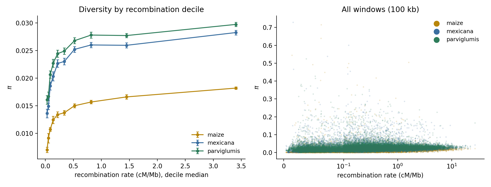

# Nucleotide Diversity vs Recombination Rate

Tests whether nucleotide diversity (π) tracks the FineMap recombination rate across the
genome, separately in maize, *Zea mays* ssp. *mexicana*, and *Zea mays* ssp. *parviglumis*.
A positive relationship is the expected signature of linked selection: diversity is
removed faster in regions where selected and neutral sites stay coupled.

## Table of Contents

- [Input Data](#input-data)
- [Why Not pixy](#why-not-pixy)
- [Estimator](#estimator)
- [Windows](#windows)
- [Running the Analysis](#running-the-analysis)
  - [Step 1 — Population Assignments](#step-1--population-assignments)
  - [Step 2 — Windowed π](#step-2--windowed-)
  - [Step 3 — Correlation and Figure](#step-3--correlation-and-figure)
- [Results](#results)
- [Caveats](#caveats)

## Input Data

Per-chromosome all-sites VCFs covering 29 samples: 8 maize inbreds, 12 *mexicana*, and 9
*parviglumis*. The genotypes are alignment-derived pseudo-haplotypes (`GT` is a single
character, one allele per sample), produced upstream by `argprep.maf_to_sites`.

**These VCFs are unpublished and are not distributed with this repository.** Neither are
the π tables derived from them; `data/pixy/` is git-ignored. The scripts below are
general, so the analysis can be rerun against other all-sites VCFs once such data are
available, provided they are haploid: one gzipped VCF per chromosome, `FORMAT` containing
exactly one `GT` key (`GT`, `GT:DP`, `DP:GT`, ...), and each sample's `GT` a single allele
index present in `ALT` or `.`. Diploid or polyploid calls (`0/0`, `0|1`, `./.`) and records
without `GT` are rejected with an error rather than guessed at. `GT`-only records with
one-character fields (the layout of these VCFs) are parsed on a vectorised fast path;
`haploid_pi.py --self-test` checks the parser.

Two properties of these files matter downstream:

- **Invariant sites are retained** (`INFO/SC` flags each site `invariant` or `variant`).
  This is what makes an unbiased windowed π possible: without invariant sites there is no
  way to know how many callable bases a window actually contained, and π per window
  collapses to a function of SNP density.
- **Coverage is partial and uneven.** Only alignable sequence appears. On chr9, 34.6 M of
  163 Mb carry records at all, and the median 100 kb window holds ~16 k callable sites.

## Why Not pixy

[pixy](https://pixy.readthedocs.io/) is the standard tool for windowed π from all-sites
VCFs, and it is the right default: it accumulates differences and comparisons separately
so that missing data do not bias the estimate. It assumes **diploid** genotypes, however,
and these VCFs are haploid.

Coercing haploid calls into homozygous diploids (`0` → `0/0`) does let pixy run, but every
sample then contributes a within-individual comparison of zero differences, biasing π
downward by a factor of

```
2 (n - 1) / (2n - 1)
```

where *n* is the number of non-missing haplotypes at a site. That is ~0.98 at *n* = 29 but
~0.93 at *n* = 8, so the bias varies with both sample size and per-site missingness — which
makes populations of different size not directly comparable. Since the correction depends
on per-site *n*, it cannot be undone from pixy's per-window totals.

`scripts/haploid_pi.py` therefore computes the same estimator directly, and emits a table
with pixy's column names so downstream code is interchangeable.

## Estimator

At each site, for each population, let *n* be the number of non-missing haplotypes and
*c<sub>a</sub>* the count of allele *a*:

```
diffs_site = (n² - Σ c_a²) / 2
pairs_site = n (n - 1) / 2
```

Both are summed across the sites in a window, and π is the ratio of the sums. Accumulating
numerator and denominator separately — rather than averaging per-site π — is what keeps
uneven missingness from biasing the window estimate. Invariant sites contribute to the
denominator only. Sites with fewer than two called haplotypes contribute to neither.

Multiallelic sites are handled by the Σ *c<sub>a</sub>*² term without special-casing.

## Windows

Windows come from `data/finemap_hierarchical_v5.bed`, which already tiles each chromosome
in uniform 100 kb windows (21,325 windows: 21,323 at 100 kb plus two chromosome-end
remainders), contiguous from position 0 with no gaps. Measuring π on exactly the intervals
the map is defined on avoids any interpolation between the two variables.

The smoothed hierarchical map is the right choice here rather than `data/finemap_v5.bed`:
the interval-density map has 261,395 variable-width intervals, many only a few bp wide,
which are far too small to hold enough callable sites for a π estimate.

Note that the BED uses `Chr1` while the VCFs use `chr1`; `--lowercase-chrom` reconciles
this.

## Running the Analysis

### Step 1 — Population Assignments

A two-column, tab-separated, headerless file mapping each sample name, exactly as it
appears in the VCF header, to a population label:

```
<sample>	<population>
```

Samples absent from this file are excluded from the calculation, so this doubles as the
sample filter. Labels are arbitrary; π is reported once per population per window.

### Step 2 — Windowed π

```bash
python scripts/haploid_pi.py \
  --vcf combined.chr{1..10}.all_sites.vcf.gz \
  --populations data/pixy/populations.txt \
  --windows data/finemap_hierarchical_v5.bed \
  --lowercase-chrom \
  --out data/pixy/pi_finemap_windows.tsv
```

Output columns match pixy's pi table: `pop`, `chromosome`, `window_pos_1`, `window_pos_2`,
`avg_pi`, `no_sites`, `count_diffs`, `count_comparisons`.

Because the genotype fields occupy a fixed-width tail of each line, the parser slices them
as a block instead of splitting every record into fields. The whole genome runs in roughly
four minutes.

| Argument | Description |
|----------|-------------|
| `--vcf` | One gzipped VCF per chromosome; plain gzip is fine (no BGZF or index needed). Haploid `GT` only (see Input Data) |
| `--populations` | `sample<TAB>population`, no header |
| `--windows` | BED tiling each chromosome from 0 without gaps |
| `--window-size` | Window width in bp, default 100000 |
| `--lowercase-chrom` | Map BED `Chr1` to VCF `chr1` |
| `--out` | Output TSV |

### Step 3 — Correlation and Figure

```bash
python scripts/pi_vs_recombination.py \
  --pi data/pixy/pi_finemap_windows.tsv \
  --bed data/finemap_hierarchical_v5.bed \
  --gff data/v5.genes.gff3 \
  --centromeres data/NAM_centromere_coords-cenH3.csv \
  --out-prefix results/pi_vs_recombination
```

| Argument | Description |
|----------|-------------|
| `--pi` | pixy-format π table |
| `--bed` | FineMap BED; column 6 (cM/Mb) is the rate |
| `--gff`, `--centromeres` | Covariates for the partial correlation |
| `--min-sites` | Drop windows below this many callable sites, default 5000 |
| `--block-mb` | Bootstrap block size in Mb, default 5 |
| `--n-boot` | Bootstrap replicates, default 1000 |

Outputs `results/pi_vs_recombination.png`, `_summary.tsv`, and `_windows.tsv.gz`.

## Results

16,095 of 21,325 windows pass the 5,000-callable-site filter.

| Population | π (genome-wide) | Spearman ρ | 95% CI | Partial ρ |
|------------|-----------------|------------|--------|-----------|
| maize | 0.0124 | 0.368 | 0.323–0.410 | 0.229 |
| *mexicana* | 0.0205 | 0.305 | 0.258–0.347 | 0.197 |
| *parviglumis* | 0.0226 | 0.294 | 0.250–0.334 | 0.193 |

Genome-wide π reproduces the expected domestication bottleneck: maize carries roughly half
the diversity of either teosinte.

π by recombination decile, from the lowest decile (median 0.03 cM/Mb) to the highest
(median 3.40 cM/Mb):

| Population | Lowest decile | Highest decile | Fold change |
|------------|---------------|----------------|-------------|
| maize | 0.00703 | 0.01820 | 2.59× |
| *mexicana* | 0.01362 | 0.02825 | 2.07× |
| *parviglumis* | 0.01608 | 0.02972 | 1.85× |



The relationship has the shape expected under linked selection: π rises steeply across the
low-recombination deciles and saturates above roughly 0.5 cM/Mb. Maize shows both the
strongest correlation and the largest fold change, consistent with the bottleneck having
amplified the effect of drift in regions where recombination cannot break up linkage.

## Caveats

**Autocorrelation.** Adjacent windows are not independent, so the asymptotic p-value over
16 k windows is meaningless. Confidence intervals come from a chromosome-stratified block bootstrap
that resamples fixed, non-overlapping 5 Mb physical blocks within each chromosome, so all
windows in a block travel together and the autocorrelation structure is preserved.

**Shared chromosome-scale structure.** Recombination rate, gene density, and π all covary
with distance to the centromere. Controlling for gene density and centromere distance
reduces the correlation by roughly 35–40% (maize 0.368 → 0.229). A substantial independent
association survives, but over a third of the raw signal is shared large-scale structure.

**Ascertainment.** Callable-site density is itself correlated with recombination rate
(ρ ≈ −0.29): high-recombination windows have *fewer* alignable sites, plausibly because
diverse distal regions carry more indels and structural variation. This runs in a
conservative direction — if ascertainment favors conserved, low-π sequence precisely where
rate is highest, it biases π downward there and understates the positive correlation.

**Sample size.** 8, 12, and 9 haplotypes make per-window π noisy. This is acceptable for a
correlation across 16 k windows but individual windows should not be interpreted.

**Window filter.** `--min-sites 5000` discards 25% of windows, concentrated in
low-callability regions. Worth rerunning at other thresholds to confirm the result is not
sensitive to the cutoff.
