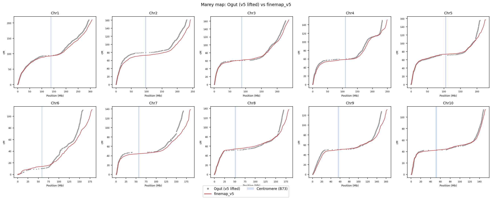
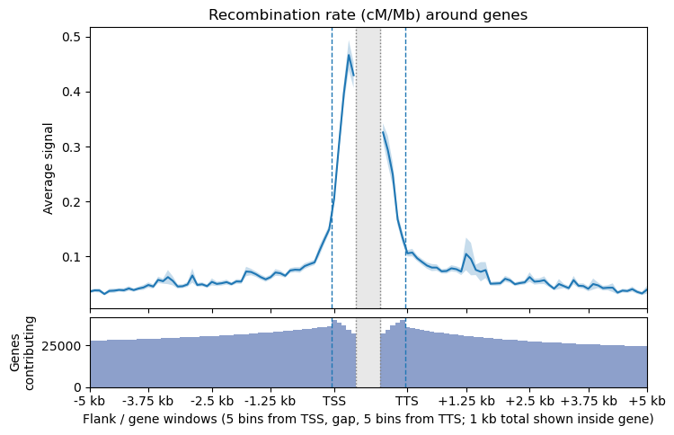
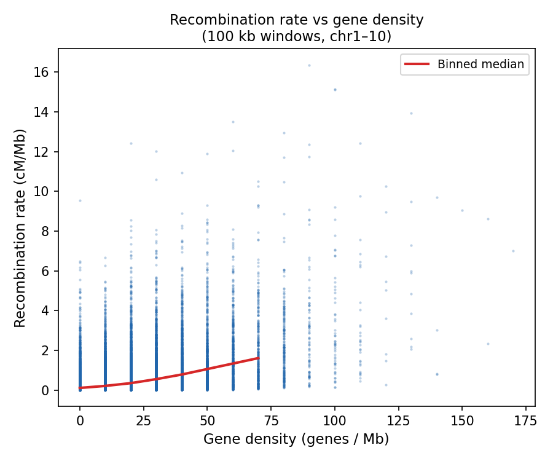
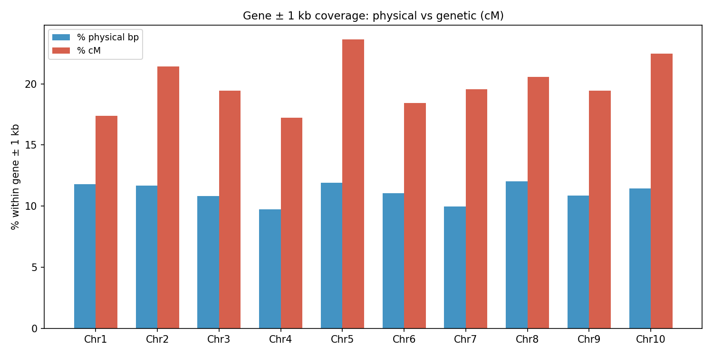
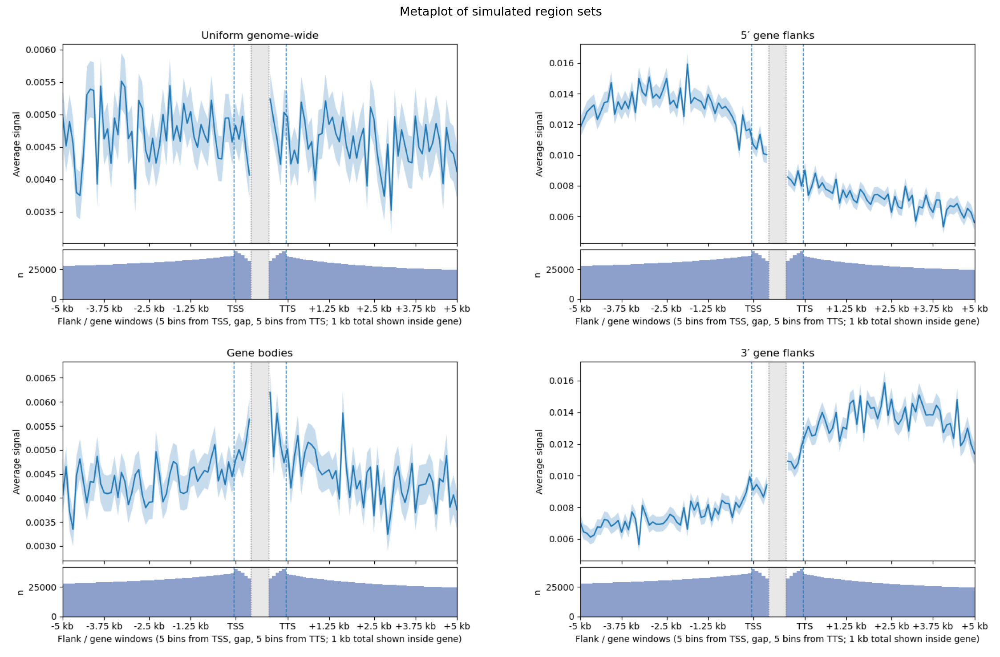

# FineMap

Builds a piecewise-constant recombination map (`finemap_v5.bed`) for maize on B73 v5 coordinates by combining crossover intervals from four published datasets, normalizing to Ogut chromosome-scale genetic lengths, and exporting per-chromosome HapMap files for use with `msprime`.

If you use, please cite: Ross-Ibarra, J. 2026. FineMap: a composite genetic map of maize. [doi.org/10.5281/zenodo.19639077](https://doi.org/10.5281/zenodo.19639077)

## Environment Notes

`environment.yml` defines the conda environment used in this repo, including the Python plotting/data dependencies and CrossMap.

## Table of Contents

- [Input Data](#input-data)
  - [Reference Files](#reference-files)
  - [Crossover Interval Sources](#crossover-interval-sources)
  - [Genetic Map](#genetic-map)
- [Pipeline](#pipeline)
  - [Step 1 — European HMM Crossover Calling](#step-1--european-hmm-crossover-calling)
  - [Step 2 — Lift-Over To B73 v5](#step-2--lift-over-to-b73-v5)
  - [Step 3 — Building jri_v5.bed](#step-3--building-jri_v5bed)
  - [Step 4 — Deriving finemap_v5.bed](#step-4--deriving-finemap_v5bed)
  - [Step 5 — HapMap Exports](#step-5--hapmap-exports)
- [Analysis](#analysis)
  - [Marey Map: Ogut vs finemap_v5](#marey-map-ogut-vs-finemap_v5)
  - [Recombination Rate Around Genes](#recombination-rate-around-genes)
  - [Recombination Rate vs Gene Density](#recombination-rate-vs-gene-density)
  - [Gene ± 1 kb Coverage: Physical vs Genetic](#gene--1-kb-coverage-physical-vs-genetic)
- [Simulation Regions](#simulation-regions)
- [Notes](#notes)

## Input Data

### Reference Files 

- `data/v5.fa.gz.fai` — B73 v5 chromosome lengths
- `data/v5.genes.gff3` — B73 v5 protein-coding gene annotations
- `data/NAM_centromere_coords-cenH3.csv` — B73 centromere coordinates (CenH3-based)

Reference data downloaded from [MaizeGDB](https://www.maizegdb.org/):

Margaret R Woodhouse, Ethalinda K Cannon, John L Portwood 2nd, Jack M Gardiner, Rita K Hayford, Olivia Haley, Carson M Andorf. (2025) Tools and Resources at the Maize Genetics and Genomics Database (MaizeGDB). Cold Spring Harb Protoc. 2025(1). 10.1101/pdb.over108430

### Crossover Interval Sources

Four published crossover interval datasets are combined. The European intervals (AGPv2) were called in-house from the Bauer et al. SNP workbook; the other three come as pre-called interval tables.

| Source | Assembly | Citation |
|--------|----------|----------|
| Rodgers-Melnick NAM | AGPv2 | Rodgers-Melnick E et al. 2015. *Recombination in diverse maize is stable, predictable, and associated with genetic load*. PNAS. |
| European HMM | AGPv2 | Bauer E et al. 2013. *Intraspecific variation of recombination rate in maize*. Genome Biology. `https://doi.org/10.1186/gb-2013-14-9-r103` |
| Samayoa LR13/LR14 landrace | AGPv4 | Samayoa LF et al. 2021. *Domestication reshaped the genetic basis of inbreeding depression in a maize landrace compared to its wild relative, teosinte*. PLoS Genetics 17(12): e1009797. `https://doi.org/10.1371/journal.pgen.1009797` |
| Samayoa teosinte | AGPv4 | same |

Raw Samayoa interval files (columns: `taxon`, `chr`, `start`, `end`):

- `data/xo_Combined_LR13_LR14_parents2_AGPv4_filter0219.txt`
- `data/xo_ZeaGBSv27raw_RareAllelesC2TeoCurated_depth_AGPv4_filtered0210.txt`

### Genetic Map

`data/ogut_fifthcM_map_agpv2.csv` — fifth-cM marker map in AGPv2 coordinates, used to set chromosome-scale genetic lengths for normalization.

`data/ogut_v5.csv` — Ogut markers lifted to B73 v5 coordinates via CrossMap (`data/v2v5.chain`). Columns: `chr`, `pos_v5`, `SNP_newID`, `cM`, `cM_norm`. Generated by `scripts/plot_marey_comparison.py`.

Ogut F et al. 2015. *Joint-multiple family linkage analysis predicts within-family variation better than single-family analysis of the maize nested association mapping population*. Heredity.

## Pipeline

### Step 1 — European HMM Crossover Calling

European crossovers were called from the Bauer et al. SNP workbook (`data/gb-2013-14-9-r103-S4.xlsx`, sheet `Table_S3`) using an HMM pipeline. This produces the 21,026 European intervals that feed into `data/jri_v5.bed`.

Script: `scripts/hmm_co_pipeline.py`

```bash
python scripts/hmm_co_pipeline.py \
  --input-xlsx data/gb-2013-14-9-r103-S4.xlsx
```

**Marker cleaning** (per population):

1. Remove rows with missing fields, `chr_phy == 0`, or `raw_data` length ≤ 6.
2. Deduplicate markers at the same `(chromosome, coordinate)`, keeping the row with the most informative genotypes.
3. Remove individuals with missingness > 0.30.
4. Remove markers with missingness > 0.20.
5. Remove markers with informative A fraction outside 0.10–0.90.
6. Remove markers with isolated-flip rate > 0.12.

This run retained 23 cleaned population matrices and 2,209 individuals.

**HMM model:** run per population, chromosome, and individual. States: `A`, `B`. Emissions: match 0.98, mismatch 0.02, missing 0.50. Distance-aware transitions: base rate 1e-8 per bp, clamped to [1e-6, 0.05]. Decoded with Viterbi. A crossover interval is called at each state change; adjacent events within 2,000,000 bp are merged. Produced 32,439 intervals.

Regenerated intermediate outputs: `results/hmm_cleaned_matrices/`, `results/hmm_co_events_long.tsv`, `results/hmm_qc_summary.tsv`. These are not tracked in the repository; rerun this step before using commands that consume `results/hmm_co_events_long.tsv`.

A Marey map of the HMM intervals can be produced with `scripts/plot_marey_map.py`. The script's default input path is currently stale, so pass the HMM output explicitly:

```bash
python scripts/plot_marey_map.py \
  results/hmm_co_events_long.tsv \
  results/marey_map_co_events.png
```

### Step 2 — Lift-Over To B73 v5

All sources are lifted using CrossMap with an endpoint-split approach: each interval is split into two single-base endpoint markers, lifted independently, then reconstructed by taking the minimum lifted start and maximum lifted end for pairs where both endpoints map to the same chromosome. Intervals where either endpoint fails to lift or lands on a different chromosome are discarded.

**Chain files:**

- `data/v2v5.chain` — AGPv2 → B73 v5, derived from an AnchorWave whole-genome alignment
- `data/v4v5.chain` — AGPv4 → B73 v5, downloaded from MaizeGDB (`https://download.maizegdb.org/Zm-B73-REFERENCE-NAM-5.0/chain_files/`)

#### AGPv2 sources (Rodgers-Melnick and European)

Convert to BED:

```bash
cat data/RodgersMelnick2015PNAS_cnnamImputedXOsegments.txt data/RodgersMelnick2015PNAS_usnamImputedXOsegments.txt | \
  grep -v 'het' | grep -v 'Family' | \
  tee >(cut -f 1,5,6 > left.txt) | cut -f 3 > right.txt

paste left.txt right.txt | sed -e 's/\r//g' | \
  awk 'BEGIN{OFS="\t"} {print $0, sprintf("RMv2_%06d", NR)}' > RodgersMelnickv2.bed

awk 'BEGIN{FS=OFS="\t"} NR > 1 {
  print $3, $6, $7, $1, sprintf("EUROv2_%06d", NR-1)
}' results/hmm_co_events_long.tsv > eurov2.bed
```

Split to endpoints, lift, and reconstruct:

```bash
cat RodgersMelnickv2.bed eurov2.bed | awk 'BEGIN{OFS="\t"} {
  x=$2; y=$3-1
  $2=x; $3=x+1; print
  $2=y; $3=y+1; print
}' > markersv2.bed

CrossMap bed data/v2v5.chain markersv2.bed markersv5.bed

awk '
{
  id=$5; chrkey=$1 FS id
  total[id]++; perchr[chrkey]++
  sample[id]=$4
  if (!(chrkey in mn) || $2 < mn[chrkey]) mn[chrkey]=$2
  if (!(chrkey in mx) || $3 > mx[chrkey]) mx[chrkey]=$3
}
END {
  for (ck in perchr) {
    split(ck, a, FS); chr=a[1]; id=a[2]
    if (total[id]==2 && perchr[ck]==2)
      print chr, mn[ck], mx[ck], sample[id], id
  }
}' OFS='\t' markersv5.bed | sort -k1,1 -k2,2n > data/jri_rm_euro_v5.bed
```

#### AGPv4 sources (Samayoa)

```bash
awk 'NR>1 {
  id=$2"_"$3"_"$4"_"$1
  print $2, $3, $3+1, id
  print $2, $4-1, $4, id
}' OFS='\t' data/xo_Combined_LR13_LR14_parents2_AGPv4_filter0219.txt > lr_markers_v4.bed

CrossMap bed data/v4v5.chain lr_markers_v4.bed lr_markers_v5.bed

awk '
{
  id=$4; chrkey=$1 FS id
  total[id]++; perchr[chrkey]++
  if (!(chrkey in mn) || $2 < mn[chrkey]) mn[chrkey]=$2
  if (!(chrkey in mx) || $3 > mx[chrkey]) mx[chrkey]=$3
}
END {
  for (ck in perchr) {
    split(ck, a, FS); chr=a[1]; id=a[2]
    if (total[id]==2 && perchr[ck]==2) {
      n=split(id,b,"_"); taxon=b[4]
      for(i=5;i<=n;i++) taxon=taxon"_"b[i]
      if (chr+0>=1 && chr+0<=10) print chr, mn[ck], mx[ck], taxon, id
    }
  }
}' OFS='\t' lr_markers_v5.bed | sort -k1,1n -k2,2n \
  > data/xo_Combined_LR13_LR14_parents2_v5.bed
```

Apply the same commands substituting `data/xo_ZeaGBSv27raw_RareAllelesC2TeoCurated_depth_AGPv4_filtered0210.txt` to produce `data/xo_ZeaGBSv27raw_RareAllelesC2TeoCurated_depth_v5.bed`.

### Step 3 — Building `jri_v5.bed`

Concatenate all four lifted sources and sort:

```bash
cat data/jri_rm_euro_v5.bed \
    data/xo_Combined_LR13_LR14_parents2_v5.bed \
    data/xo_ZeaGBSv27raw_RareAllelesC2TeoCurated_depth_v5.bed \
  | sort -k1,1V -k2,2n > data/jri_v5.bed
```

`data/jri_v5.bed` contains 373,747 crossover intervals across four sources:

| Source | Raw intervals | Lifted | Retention |
|--------|--------------|--------|-----------|
| Rodgers-Melnick NAM | 135,995 | 88,863 | ~65.3% |
| European HMM | 32,439 | 21,026 | ~64.8% |
| Samayoa LR13/LR14 landrace | 137,100 | 136,709 | ~99.7% |
| Samayoa teosinte | 127,546 | 127,149 | ~99.7% |

### Step 4 — Deriving `finemap_v5.bed`

`data/finemap_v5.bed` is a non-overlapping BED6 track representing the crossover density in `data/jri_v5.bed` as a piecewise-constant recombination rate, scaled so that each chromosome's total genetic length matches the Ogut map.

**Method:**

1. Assign each interval in `data/jri_v5.bed` a per-bp weight of `1 / (end − start)`.
2. Use a sweep-line algorithm to sum weights across all overlapping intervals at each position; merge consecutive positions with equal summed weight into non-overlapping segments.
3. For each chromosome, normalize weights so the interval-weighted sum equals the Ogut chromosome genetic length in cM.
4. Walk segments in coordinate order, accumulating `cM_start` and `cM_end`; report `cM_per_Mb = (cM_end − cM_start) / (end − start) × 10⁶`.

**Output columns:** `chrom`, `start`, `end`, `cM_start`, `cM_end`, `cM_per_Mb`

**Result:** 214,104 segments; genome-wide average 0.694 cM/Mb across covered sequence.

**Ogut chromosome lengths used for scaling:**

| Chr | cM | Chr | cM |
|-----|----|-----|----|
| Chr1 | 210.4 | Chr6 | 111.4 |
| Chr2 | 161.2 | Chr7 | 138.4 |
| Chr3 | 163.4 | Chr8 | 137.4 |
| Chr4 | 151.8 | Chr9 | 131.2 |
| Chr5 | 157.0 | Chr10 | 113.0 |

Script: `scripts/build_finemap.py` (also regenerates HapMap files)

```bash
python scripts/build_finemap.py
```

### Step 5 — HapMap Exports

`data/hapmap/chr{1..10}.hapmap.tsv` — per-chromosome HapMap-format files derived from `data/finemap_v5.bed` for use with `msprime.RateMap.read_hapmap()`.

Format: `Chromosome`, `Position(bp)`, `Rate(cM/Mb)`, `Map(cM)`. One file per chromosome; terminal row rate set to 0 per `msprime` convention. Generated by `scripts/build_finemap.py`.

## Analysis

### Marey Map: Ogut vs finemap_v5

Compares the Ogut genetic map (AGPv2 markers lifted to v5 via CrossMap) against `finemap_v5.bed` across all ten chromosomes in a 2×5 grid. B73 centromere positions are shaded.

Script: `scripts/plot_marey_comparison.py`  
Outputs: `results/marey_ogut_vs_finemap.png`, `data/ogut_v5.csv`

```bash
python scripts/plot_marey_comparison.py
```

By default, the script reads the tracked `data/ogut_v5.csv` and writes only the plot. To regenerate the tracked lifted Ogut table, run:

```bash
python scripts/plot_marey_comparison.py --rebuild-ogut-v5 --write-ogut-v5
```



### Recombination Rate Around Genes

`scripts/metaplot.py` computes mean signal in bins across gene bodies. To plot recombination rate with 5 kb flanks and 500 bp windows at each gene end:

```bash
python scripts/metaplot.py \
  --gff data/v5.genes.gff3 \
  --input data/finemap_v5.bed \
  --value-column 6 \
  --bin-size 100 \
  --flanking-bp 5000 \
  --body-bins 5 \
  --uniform \
  --title "Recombination rate (cM/Mb) around genes" \
  --output results/metaplot_recombination.png \
  --no-show
```



Uses 38,418 protein-coding genes on chr1–chr10. With `--bin-size 100` and `--body-bins 5`, each gene-end window is exactly 500 bp; flanks extend 5 kb from TSS and TTS. The `--uniform` flag distributes each segment's rate across its full physical span rather than assigning it to a midpoint.

The gene-body panel is built from whole `--bin-size` windows taken inward from each gene end rather than from a length-normalized rescaling of the full body. For genes shorter than `2 * --body-bins * --bin-size`, the script keeps as many complete bins as fit from the TSS side and from the TTS side and leaves the central gap empty; if the available number of whole bins is odd, the middle bin is dropped.

Key `metaplot.py` arguments:

| Argument | Description |
|----------|-------------|
| `--gff` | Gene annotation GFF/GFF3 |
| `--input` | Signal BED |
| `--value-column` | 1-based value column, default 4; use 6 for `data/finemap_v5.bed` |
| `--bin-size` | Bin width in bp; must divide `--flanking-bp` |
| `--flanking-bp` | Flank length on each side of TSS/TTS |
| `--body-bins` | Bins shown from each gene end inside the body |
| `--uniform` | Spread interval value across its full span (use for rate data) |
| `--output` | Output PDF (default: `metaplot.pdf`) |
| `--no-show` | Suppress interactive display |

### Recombination Rate vs Gene Density

Plots gene density (genes/Mb) against weighted-average cM/Mb across 100 kb windows genome-wide, with binned medians overlaid.

Script: `scripts/plot_rate_vs_gene_density.py`  
Output: `results/rate_vs_gene_density.png`

```bash
python scripts/plot_rate_vs_gene_density.py
```



### Gene ± 1 kb Coverage: Physical vs Genetic

For each chromosome, computes the fraction of physical bp and fraction of total cM that fall within 1 kb of any gene body (gene ± 1 kb intervals merged). Recombination is consistently enriched near genes relative to their physical footprint.

Script: `scripts/plot_gene_cM_coverage.py` (accepts one or more `--flank` values; default 1000 bp)

```bash
python scripts/plot_gene_cM_coverage.py --flank 100 1000
```



| Chr | % bp (±100 bp) | % bp (±1 kb) | % cM (±100 bp) | % cM (±1 kb) |
|-----|---------------|--------------|----------------|--------------|
| 1   | 9.0 | 11.8 | 13.2 | 17.4 |
| 2   | 8.8 | 11.7 | 16.1 | 21.4 |
| 3   | 8.3 | 10.8 | 14.6 | 19.5 |
| 4   | 7.3 |  9.7 | 12.8 | 17.2 |
| 5   | 9.1 | 11.9 | 17.7 | 23.6 |
| 6   | 8.2 | 11.0 | 13.7 | 18.4 |
| 7   | 7.5 | 10.0 | 14.7 | 19.6 |
| 8   | 9.2 | 12.0 | 15.4 | 20.5 |
| 9   | 8.1 | 10.9 | 14.4 | 19.5 |
| 10  | 8.8 | 11.4 | 16.9 | 22.5 |

Shrinking the flank from ±1 kb to ±100 bp reduces %bp by ~2–3 points and %cM by ~4–5 points, but the cM/bp enrichment ratio (~1.5–1.9×) is stable across both windows, suggesting elevated recombination near genes is distributed broadly within the 1 kb flanks rather than concentrated at gene edges.

## Simulation Regions

Simulated BED region sets with interval lengths drawn from the empirical distribution of `data/jri_v5.bed`, placed on B73 v5 chromosomes chr1–chr10. Used for comparison with observed crossover distributions.

| File | Placement |
|------|-----------|
| `data/example1.bed` | Uniform genome-wide |
| `data/example2.bed` | Enriched in strand-aware 5′ gene flanks |
| `data/example3.bed` | Enriched in gene bodies (excluding first and last 5 kb) |
| `data/example4.bed` | Enriched in strand-aware 3′ gene flanks |

Script: `scripts/simulate_example_regions.py`

```bash
python scripts/simulate_example_regions.py
```

This regenerates `data/example1.bed` through `data/example4.bed` and writes `data/simulation_readme.md`.

Metaplots across all four sets (5 kb flanks, 500 bp gene-end windows):

```bash
python scripts/plot_example_metaplots.py
```



## Notes

- Each crossover is localized to an interval between flanking markers; the exact breakpoint is unknown and precision is bounded by marker spacing in the source data.
- Regions with no crossover coverage in `data/jri_v5.bed` (primarily pericentromeric heterochromatin) carry no rate in `data/finemap_v5.bed` and are excluded from genome-wide averages.
- The Ogut map sets total cM per chromosome only; the within-chromosome rate distribution comes entirely from the crossover interval data.

## Acknowledgements

I'd like to thank Wojtek Pawlowski, Quinn Johnson and other members of the Pawlowski lab for helpful discussion, sharing data, and code. Nate Pope, James Holland, and Peter Bradbury all provided helpful advice and insight as well.
