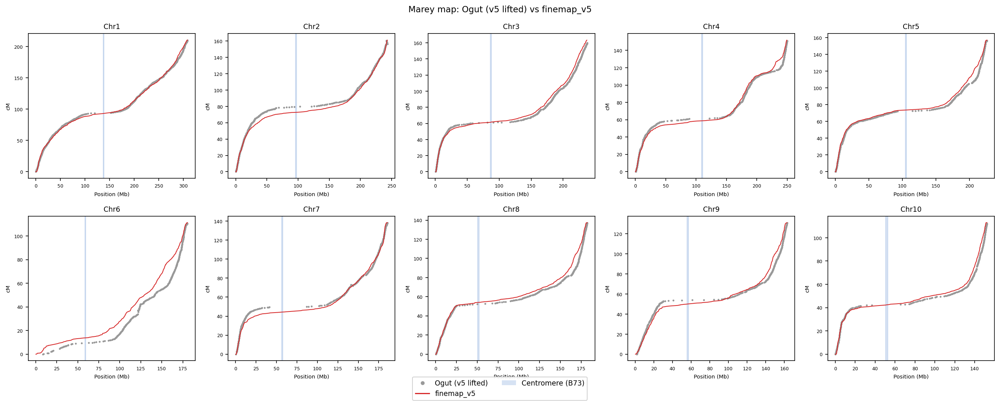
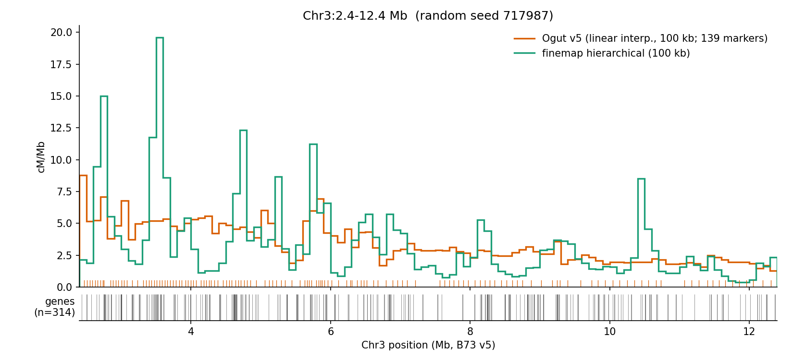
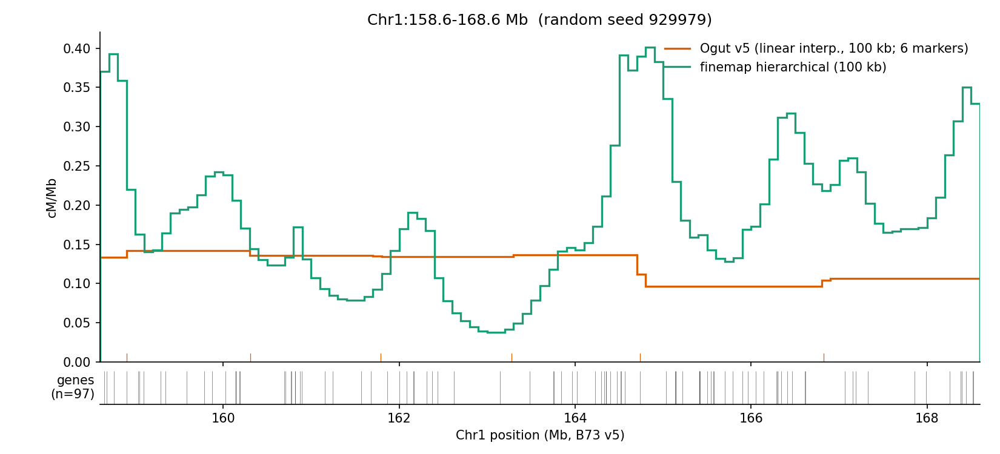
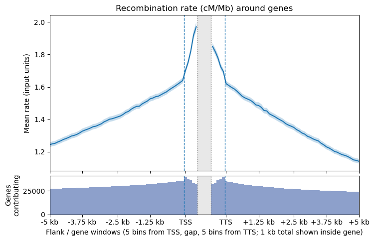
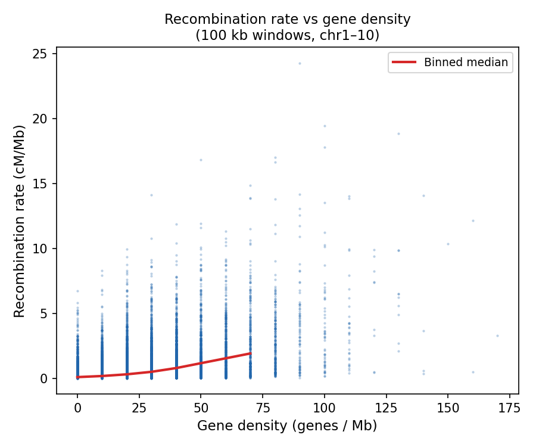
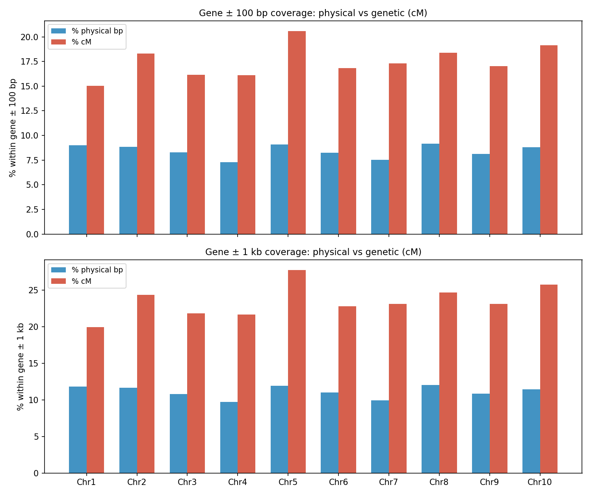
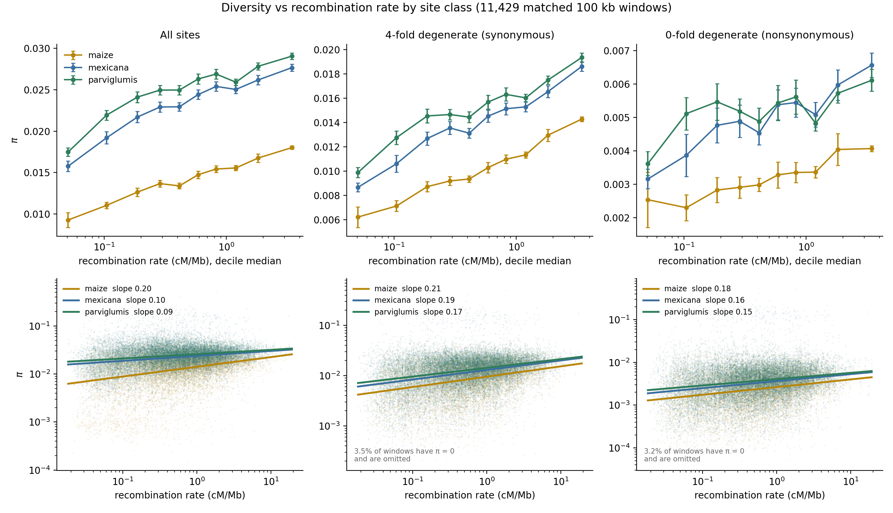
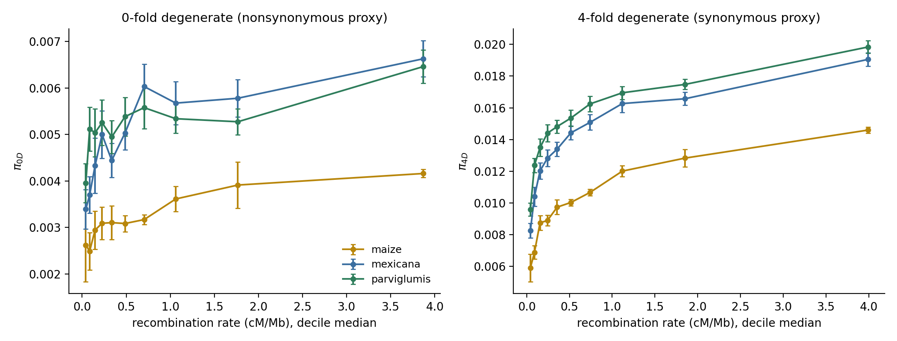
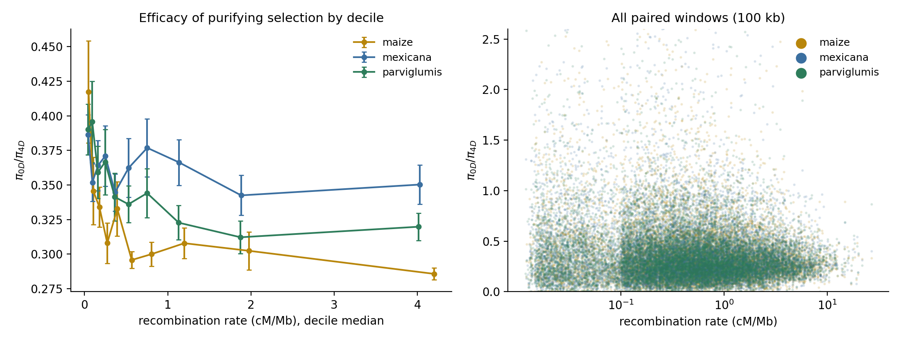

# FineMap

Builds Ogut-calibrated, piecewise-constant recombination maps for maize on B73 v5 coordinates by combining crossover intervals from four published datasets. The crossover data determine the within-chromosome rate profile, while the Ogut map supplies each chromosome's total genetic length. The original interval-density map (`finemap_v5.bed`) is the default; a smoothed hierarchical interval-censored map (`finemap_hierarchical_v5.bed`) is provided as an alternative.

If you use, please cite: Ross-Ibarra, J. 2026. FineMap: a composite genetic map of maize. [doi.org/10.5281/zenodo.19639077](https://doi.org/10.5281/zenodo.19639077)

**To reproduce the maps and analyses** (environment, input files, commands, script options, file formats and checks), see [PIPELINE.md](PIPELINE.md).

## Data

Four published crossover interval datasets are combined:

| Source | Assembly | Citation |
|--------|----------|----------|
| Rodgers-Melnick NAM | AGPv2 | Rodgers-Melnick E et al. 2015. *Recombination in diverse maize is stable, predictable, and associated with genetic load*. PNAS. |
| European HMM | AGPv2 | Bauer E et al. 2013. *Intraspecific variation of recombination rate in maize*. Genome Biology. `https://doi.org/10.1186/gb-2013-14-9-r103` |
| Samayoa LR13/LR14 landrace | AGPv4 | Samayoa LF et al. 2021. *Domestication reshaped the genetic basis of inbreeding depression in a maize landrace compared to its wild relative, teosinte*. PLoS Genetics 17(12): e1009797. `https://doi.org/10.1371/journal.pgen.1009797` |
| Samayoa teosinte | AGPv4 | same |

The Rodgers-Melnick and Samayoa data are pre-called interval tables. The European intervals were called in-house from the Bauer et al. SNP genotypes with a two-state HMM, after per-population marker and individual cleaning.

Chromosome genetic lengths come from the Ogut fifth-cM map (Ogut F et al. 2015. *Joint-multiple family linkage analysis predicts within-family variation better than single-family analysis of the maize nested association mapping population*. Heredity.), whose AGPv2 markers were lifted to v5 and kept only where the marker's flanking sequence is found at the lifted position.

Reference genome, gene annotation and centromere coordinates are from [MaizeGDB](https://www.maizegdb.org/) (Woodhouse MR et al. 2025. Tools and Resources at the Maize Genetics and Genomics Database (MaizeGDB). Cold Spring Harb Protoc. 2025(1). 10.1101/pdb.over108430).

## Method

**Lift-over.** Both endpoints of every crossover interval are lifted to B73 v5 through whole-genome chain files (AGPv2→v5 from an AnchorWave alignment; AGPv4→v5 from MaizeGDB). An interval is kept only if both endpoints map uniquely to the same v5 chromosome and strand in a consistent order; endpoints on different chains are kept if the interval length is roughly preserved. The combined set, `data/jri_v5.bed`, contains 402,018 crossover intervals (retention by source: 86.5% Rodgers-Melnick, 83.8% European, 97.1% and 97.2% for the Samayoa landrace and teosinte sets). Rejection rules, per-source counts and a sensitivity analysis of the cross-chain rule are in [PIPELINE.md](PIPELINE.md#step-2--lift-over-to-b73-v5).

**Default map (`finemap_v5.bed`).** Each crossover is spread uniformly over its interval, so an interval of length L contributes a per-bp density of 1/L and one crossover in total. Densities are summed across all overlapping intervals, giving a piecewise-constant rate with 261,395 segments. Each chromosome's profile is then scaled so its total length equals the Ogut chromosome length in cM.

**Hierarchical map (`finemap_hierarchical_v5.bed`).** Rather than adding independent uniform densities, this alternative treats each crossover location as interval-censored under a shared chromosome-wide rate function. The log-rate is piecewise constant in 100 kb bins, with a Gaussian random-walk penalty between neighbouring bins that partially pools adjacent bins, reducing sampling noise while allowing supported local peaks. Each chromosome is fitted by maximum a posteriori optimization and then scaled to the same Ogut length.

**Ogut calibration.** In both maps the crossover data set only the relative rate profile within a chromosome; the Ogut map sets total cM per chromosome. Interval locations alone do not identify absolute genetic length, and the effective number and structure of informative meioses are not consistently available across the input populations.

**Caveats.**

- Each crossover is localized only to the interval between flanking markers; precision is bounded by marker spacing in the source data. kb-scale structure in `finemap_v5.bed` is dominated by a few narrow intervals and should not be interpreted as hotspots (see [below](#recombination-hotspots-and-the-resolution-limit-of-finemap)).
- Regions with no crossover coverage in `data/jri_v5.bed` (primarily pericentromeric heterochromatin) carry no rate in `data/finemap_v5.bed` and are excluded from genome-wide averages.
- Use `finemap_hierarchical_v5.bed` explicitly when downstream analyses benefit from partial pooling across neighbouring 100 kb bins.

## Output Files

- `data/finemap_v5.bed` — default map; columns `chrom`, `start`, `end`, `cM_start`, `cM_end`, `cM_per_Mb`
- `data/finemap_hierarchical_v5.bed` — hierarchical map, 21,325 100 kb segments; same columns
- `data/hapmap/chr{1..10}.hapmap.tsv` — `finemap_v5.bed` in HapMap format for `msprime.RateMap.read_hapmap()`
- `data/jri_v5.bed` — the combined lifted crossover intervals (`chr`, `start`, `end`, `sample`, `id`)
- `data/ogut_v5.csv` — sequence-verified Ogut markers on v5 coordinates

## Results

### Marey Map: Ogut vs finemap_v5

The Ogut map (AGPv2 markers lifted to v5) against `finemap_v5.bed` on all ten chromosomes; B73 centromeres are shaded.

### Local Rate: Ogut vs finemap_hierarchical_v5

cM/Mb in two randomly drawn 10 Mb windows, with the Ogut rate computed by interpolating Ogut cM at the same 100 kb bin edges as the hierarchical map. Orange ticks mark Ogut markers; the lower strip is a rug of gene midpoints. In the gene-rich distal arm of chromosome 3 (139 Ogut markers), both maps show the same broad decline in rate away from the telomere, but the hierarchical map resolves sub-Mb peaks, often over gene clusters, that the Ogut map smooths out (r = 0.45 across 100 kb bins). On the long arm of chromosome 1, only 6 Ogut markers fall in the window, so the Ogut rate is nearly flat, while the hierarchical map varies about tenfold, with its lowest rates in gene-poor stretches.

### Recombination Rate Around Genes

Mean recombination rate across 39,418 protein-coding genes (5 kb flanks, 500 bp windows at each gene end) rises from about 1.2 cM/Mb at ±5 kb to about 1.7 cM/Mb at the TSS and TTS and peaks near 2.0 cM/Mb inside the gene, well above the genome-wide mean of 0.70 cM/Mb because genes sit mostly in the high-recombination chromosome arms. Averaging details are in [PIPELINE.md](PIPELINE.md#recombination-rate-around-genes).

### Recombination Rate vs Gene Density

Gene density (genes/Mb) against weighted-average cM/Mb in 100 kb windows genome-wide, with binned medians overlaid.

### Gene ± 1 kb Coverage: Physical vs Genetic

On every chromosome, the share of total cM within 1 kb of a gene exceeds the share of physical sequence there, and the cM/bp enrichment ratio (~1.7–2.3×) is stable whether flanks are ±100 bp or ±1 kb, suggesting elevated recombination is spread broadly within the flanks rather than concentrated at gene edges. Per-chromosome table in [PIPELINE.md](PIPELINE.md#gene--1-kb-coverage-physical-vs-genetic).

### Nucleotide Diversity vs Recombination Rate

π in the 100 kb windows of `finemap_hierarchical_v5.bed` rises steeply with recombination and saturates above ~0.5 cM/Mb, the expected signature of linked selection. Details: [PI_VS_RECOMBINATION.md](PI_VS_RECOMBINATION.md). The genotype data are unpublished and not distributed with this repository.

### Coding-Site Diversity (0D/4D) vs Recombination Rate

π at 0-fold (nonsynonymous proxy) and 4-fold (synonymous proxy) degenerate sites both rise with recombination, more steeply at 4D, and π0D/π4D — an index of the efficacy of purifying selection — declines weakly but consistently with rate in all three populations. On the 11,429 windows that pass every callable-site filter, 4D > 0D in every population and the decile relationship is close to log-linear rather than saturating. Details: [PI_CODING_VS_RECOMBINATION.md](PI_CODING_VS_RECOMBINATION.md).

### Recombination Hotspots and the Resolution Limit of FineMap

An attempt to relate π to distance from recombination hotspots instead established a methodological limit: **kb-scale structure in the interval-density map is dominated by a few narrow crossover intervals.** Because each interval contributes one crossover spread over its length, a 100 bp interval has ~1,316× the per-bp density of a median one. The source intervals have a median width of 132 kb and only 8.3% are narrower than 10 kb, yet that narrow tail supplies a median 79% of the crossover weight in any hotspot called from the map. Apparent kb-scale hotspots therefore largely track marker density in the source crosses rather than recombination, and controlling for local background rate cannot rescue this, since the background is built from the same smeared crossovers. Analyses at 100 kb and coarser, including those above, average over many intervals, so the effect on them is expected to be smaller, but this was not tested directly. Full writeup: [PI_VS_HOTSPOT_DISTANCE.md](PI_VS_HOTSPOT_DISTANCE.md).

## Acknowledgements

I'd like to thank Wojtek Pawlowski, Quinn Johnson and other members of the Pawlowski lab for helpful discussion, sharing data, and code. Nate Pope, James Holland, and Peter Bradbury all provided helpful advice and insight as well.
